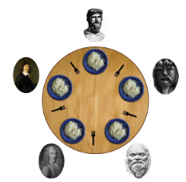
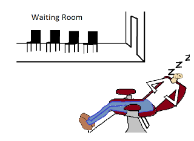

## Exercises PL1 - Concurrent and Parallel Programming in Shared Memory Systems

## 1 - Dining Philosophers

__The dining philosopher is a classic synchronization problem:__
- 5 philosophers are sharing a circular table and they eat and think
  alternatively
- Each philosopher has its own plate, but there are only 5 forks. A
  philosopher needs both their right and left fork to eat.
- A hungry philosopher may only eat if there are both forks available.
- Otherwise a philosopher puts down their fork and begin thinking
  again.

Implement a solution using pthreads that prevents the philosophers
  from starving.

##
## 2 - The Sleeping Barber

__A classic problem which considers a barbershop with one
barber, one barber chair, and a waiting room with N chairs (N
may be 0) for waiting customers:__
- If there are no customers, the barber falls asleep in the
  chair
- A customer must wake the barber if he is asleep
- If a customer arrives while the barber is working, the
  customer leaves if all chairs are occupied and sits in an
  empty chair if it's available
- When the barber finishes a haircut, he inspects the
  waiting room to see if there are any waiting customers
  and falls asleep if there are none

  a. Implement a solution using pthreads.\
  b. Change the solution to allow for multiple barbers.

##
## 3- Matrix multiplication

Write a pthreads program that performs parallel matrix multiplication. The size of the input matrices can
be fixed, and the matrices global.\
a. Implement a version where each thread is responsible for a single position of the result matrix.\
b. Implement a version where each thread is responsible for one line of the result matrix\
c. Implement a version where each thread is responsible for a number of user input lines of the result
matrix\
d. Determine the time it takes to perform the multiplications in the previous versions, and compare it to
a sequential implementation. Use also different sizes of the matrices. What can you conclude?

##
## 4 - Quick Sort

Quick Sort is a sorting algorithm which uses a divide and conquer approach. The algorithm sorts the
numbers by first dividing the list into two sublists, so that all the numbers in one sublist are smaller than
all the numbers in the second sublist. This is done by selecting one number, the pivot, against which all
other numbers are compared to. Then the algorithm is applied recursively to the two sublists.

Write a pthreads program that sorts an array using quick sort. The size of the array can be fixed, and the
array global. The decision on the pivot is irrelevant (e.g. take the first).\
a. Implement a version where each recursive call is performed by a new thread\
b. Implement a version where recursive calls are done by the same thread if the size of the sublist is
smaller than a predefined threshold\
d. Determine the time it takes to perform the sorting in the previous versions, and compare it to a
sequential implementation. Use also different sizes of the array. What can you conclude?

## 5 - Thread Pools
Write a Pthreads program that implements a thread pool concept and a “task queue.” The main thread
begins by creating a starting a specified number of threads that immediately go to sleep in a condition
wait.

The main thread then generates tasks to be executed by the threads in the pool; each time a new task is
created, it awakens a thread with a condition signal. When a thread finish executing a task, it should return
to a condition wait, if there are no other tasks in the queue. If there are other tasks, it should continue
executing. 

Tasks can be for instance calculating factorial or Fibonacci numbers (each task is a number).

When the main thread completes generating tasks, it sets a global variable indicating that the work is
complete, and awakens all the threads to terminate.

To create more work, change the code so that the main thread creates several tasks before waking up
threads.

